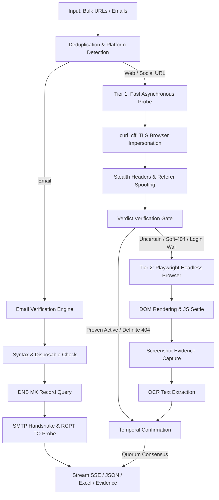

# Enterprise URL & Social Media Validation Engine

[](https://www.python.org/)
[](https://fastapi.tiangolo.com/)
[](https://playwright.dev/)
[]()
[]()

An enterprise-grade, high-throughput validation microservice designed to verify whether social media profiles, posts, documents, website URLs, and email addresses are **Active**, **Taken Down**, or **Uncertain** with cryptographic and heuristic confidence.

Built to solve real-world web scraping hurdles: Cloudflare/Akamai bot detection, login walls, JavaScript Single Page Application (SPA) shells, soft-404s (HTTP 200 with "Page Not Found"), domain parking redirects, and SMTP delivery checks.

---

## Architecture Overview



---

## Key Features

- **Multi-Platform Intelligence**: Specialized detection heuristics for:
  - **Meta / Facebook**: Profile, Page, Group, Post, and mobile redirect validation with session cookie support.
  - **Instagram**: Anti-bot evasion, profile detection, login wall bypass, and suspension analysis.
  - **X (Twitter)**: Account suspension, deactivation, and deleted tweet detection.
  - **LinkedIn**: Profile, company page, and article status check.
  - **YouTube**: Channel, handle, video, and community post verification.
  - **Telegram**: Public channel and invite link availability.
  - **Scribd**: Document takedown, removal notices, and Cloudflare challenge evasion.
  - **Generic Web**: Status codes, SSL validity, DNS resolution, and redirect drift.
  - **Email Addresses**: Full RFC syntax validation, disposable domain checks, DNS MX lookups, and direct SMTP mailbox probing (`RCPT TO`).

- **Verdict Verification Gate (Anti-Soft-404)**:
  - Audits every HTTP response body against known removal notices and baseline signatures. Prevents false `active` classifications when servers return HTTP 200 for a "user not found" page.

- **Playwright Headless Browser Fallback**:
  - Automatically escalates uncertain verdicts to real headless Chromium instances with anti-detection evasions (`stealth.py`), waiting for client-side JavaScript hydration before evaluating page state.

- **Temporal Confirmation**:
  - Eliminates false takedown reports caused by transient network glitches through quorum-based verification (`CONFIRM_QUORUM` of `CONFIRM_ATTEMPTS`).

- **Parking Page Detection**:
  - Identifies domain squatter and registrar landing pages (GoDaddy, Sedo, Dan.com, Namecheap, HugeDomains, etc.).

- **Evidence Collection & OCR**:
  - Captures full-page PNG screenshots of target pages into an evidence repository, with optional Tesseract OCR to read text rendered inside images or canvas elements.

- **High-Throughput Concurrency & Resilience**:
  - `asyncio` architecture with per-host adaptive rate limiting, circuit breaker protection, and thread pool scaling.

---

## Security & Session Management

To inspect private, age-restricted, or authenticated pages across social networks without risking account bans or leaking credentials, this service supports session cookies.

> [!IMPORTANT]
> **Never commit `cookies.json` to version control.** Real session tokens (`c_user`, `sessionid`, `auth_token`) can be used to hijack accounts. `cookies.json` is ignored in `.gitignore`.

### Configuring Cookies

1. Copy the example cookie template:
   ```bash
   cp cookies.example.json cookies.json
   ```
2. Populate your local `cookies.json` with active session cookies for Facebook, Instagram, LinkedIn, or X.
3. **Cloud & Render Deployments**: You can supply cookies without creating files by setting the `COOKIES_JSON` environment variable:
   ```bash
   export COOKIES_JSON='{"cookies":{"facebook":[],"instagram":[],"linkedin":[],"x":[]}}'
   ```
   Or specify a custom file path via `COOKIES_FILE`:
   ```bash
   export COOKIES_FILE=/etc/secrets/cookies.json
   ```

---

## Getting Started

### Prerequisites

- Python 3.10 or higher
- Chromium (for Playwright browser fallback)
- *(Optional)* Tesseract OCR (if `URLCHECK_ENABLE_SCREENSHOT_OCR` is enabled)

### Installation

1. **Clone the repository**:
   ```bash
   git clone https://github.com/Saisanjay23/URLS-validator.git
   cd URLS-validator
   ```

2. **Create and activate a virtual environment**:
   ```bash
   python -m venv venv
   # On Windows (PowerShell):
   .\venv\Scripts\Activate.ps1
   # On Linux/macOS:
   source venv/bin/activate
   ```

3. **Install dependencies**:
   ```bash
   pip install -r requirements.txt
   playwright install chromium
   ```

4. **Start the application**:
   ```bash
   uvicorn app:app --host 0.0.0.0 --port 8000 --reload
   ```

5. **Open the Dashboard**:
   Navigate to [http://localhost:8000](http://localhost:8000) in your browser.

---

## API Reference

### 1. Check URLs (JSON Array)
- **Endpoint**: `POST /api/check/json`
- **Headers**: `Content-Type: application/json`
- **Request Body**:
  ```json
  {
    "urls": [
      "https://www.instagram.com/instagram",
      "https://x.com/jack",
      "contact@example.com"
    ],
    "screenshot_mode": "off"
  }
  ```
- **Response**:
  ```json
  {
    "total": 3,
    "results": [
      {
        "url": "https://www.instagram.com/instagram",
        "platform": "instagram",
        "status": "active",
        "reason": "Profile loaded successfully",
        "http_code": 200,
        "confidence": 95
      },
      {
        "url": "contact@example.com",
        "platform": "email",
        "status": "active",
        "reason": "Mailbox exists and accepts messages (SMTP 250)",
        "http_code": 250,
        "confidence": 90
      }
    ]
  }
  ```

### 2. Stream URL Checks (Server-Sent Events)
- **Endpoint**: `POST /api/check/stream`
- Yields real-time SSE progress events as each URL is resolved, enabling instant UI updates for bulk workloads.

### 3. Service Health & Diagnostics
- **Endpoint**: `GET /api/health`
- Returns system status, active feature flags, and circuit breaker state.

### 4. Metrics & Performance
- **Endpoint**: `GET /api/metrics`
- Returns throughput metrics, average latency, and platform breakdown.

### 5. Export Results
- **Excel Spreadsheet**: `POST /api/export/excel`
- **Evidence ZIP Archive**: `POST /api/export/zip`

---

## Configuration & Feature Flags

Every subsystem can be tuned or toggled via environment variables:

| Environment Variable | Default | Description |
| :--- | :--- | :--- |
| `URLCHECK_CONCURRENT` | `50` | Maximum concurrent URLs validated simultaneously |
| `URLCHECK_ENABLE_PLAYWRIGHT_FALLBACK` | `true` | Headless browser escalation for JS-heavy SPAs |
| `URLCHECK_ENABLE_VERDICT_AUDIT` | `true` | Audit response bodies against baseline 404 signatures |
| `URLCHECK_ENABLE_TEMPORAL_CONFIRMATION`| `true` | Quorum verification for takedown verdicts |
| `URLCHECK_CONFIRM_QUORUM` | `2` | Number of dead observations required to confirm takedown |
| `URLCHECK_ENABLE_EMAIL_VERIFICATION` | `true` | Enable MX record and SMTP mailbox checking |
| `URLCHECK_ENABLE_STEALTH_HEADERS` | `true` | Anti-bot header generation & TLS fingerprint rotation |
| `URLCHECK_ENABLE_SCREENSHOT_CAPTURE` | `false` | Capture PNG screenshots for takedown evidence |
| `URLCHECK_ENABLE_SCREENSHOT_OCR` | `false` | Run OCR on screenshots to detect embedded notices |
| `URLCHECK_COOKIES_JSON` | `""` | Raw JSON string containing session cookies |
| `URLCHECK_COOKIES_FILE` | `cookies.json` | Path to cookie storage file |

---

## Testing

The project includes an extensive test suite covering unit behaviors, network retry models, baseline calibrations, and regressions:

```bash
# Run full test suite
python -m pytest

# Run specific test modules
python -m pytest tests/test_verify.py
python -m pytest tests/test_email_checker.py
python -m pytest tests/test_cookies.py

# Run historical regression checks
python tests/regression_check.py
```

---

## Project Structure

```
├── api/
│   └── routes.py              # FastAPI endpoints (JSON, SSE, Export, Cookies, Health)
├── backend/
│   ├── config.py              # Central feature flags and tuning knobs
│   ├── cookies.py             # Cookie loader with env-var and secret file fallback
│   ├── email_checker.py       # Syntax, disposable domain, MX DNS, & SMTP validation
│   ├── evidence.py            # Evidence models and verification signals
│   ├── fast_checker.py        # Asynchronous validation pipeline & platform engines
│   ├── intelligence.py        # Error categorization and anomaly classification
│   ├── logger.py              # Structured logging with file rotation
│   ├── metrics.py             # In-memory latency and throughput analytics
│   ├── networking.py          # Adaptive rate limiting and circuit breakers
│   ├── parking.py             # Domain parking and registrar landing page detection
│   ├── screenshot.py          # Playwright screenshot capture and OCR extraction
│   ├── stealth.py             # TLS fingerprint impersonation & stealth headers
│   ├── url_utils.py           # URL normalization, routing, and deduplication
│   └── verify.py              # Verdict verification gate and baseline calibration
├── frontend/
│   ├── index.html             # Responsive web validation dashboard
│   ├── app.js                 # Frontend application & SSE stream consumer
│   └── style.css              # Dashboard styling
├── tests/                     # 158 passing unit, integration, and regression tests
├── cookies.example.json       # Clean cookie template for development
├── requirements.txt           # Python package dependencies
├── app.py                     # Microservice bootstrap
└── README.md                  # Project documentation
```

---

## License

This project is licensed under the MIT License - see the LICENSE file for details.